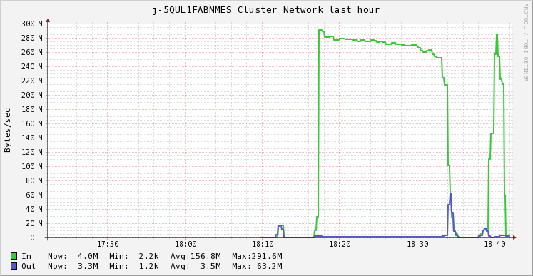

# Processing the GDELT dataset on AWS
In this blog post, the GDELT dataset will be evaluated on AWS elastic mapReduce (EMR). The goal is to process the dataset consisting of 157378 segments on 20 `c4.8xlarge` core nodes in under 30 minutes. Herefore, several steps will be performed to test the code.

## Tweaking the code to run on AWS
From the first assignment we have two implementations for processing the GDELT dataset, namely an RDD implementation and a DataFrame implementation. From this point on the DataFrame implementation is used because it was found to yield better performance when operating on a large number of segments.

The code is slightly altered in order to run on EMR:

- Remove .master('local') from `SparkSession.builder()` since this is automatically set by the cluster
- Change input and output paths to s3
- Read segments directly form GDELT s3 bucket

## Processing 100 segments
After adapting the code to work in the AWS environment, a test run was performed on 100 segments using 3 `m4.large` machines (single master and 2 nodes). The resulting .json file can be seen below.

```
{"date":"2015-02-18","collect_list(named_struct(NamePlaceholder(), topic, NamePlaceholder(), count))":[{"topic":"Islamic State","count":1787},{"topic":"United States","count":1210},{"topic":"New York","count":727},{"topic":"White House","count":489},{"topic":"Los Angeles","count":424},{"topic":"Associated Press","count":385},{"topic":"New Zealand","count":353},{"topic":"United Kingdom","count":325},{"topic":"Jeb Bush","count":298},{"topic":"Practice Wrestling Room","count":280}]}

{"date":"2015-02-19","collect_list(named_struct(NamePlaceholder(), topic, NamePlaceholder(), count))":[{"topic":"United States","count":20335},{"topic":"Islamic State","count":15411},{"topic":"New York","count":13131},{"topic":"United Kingdom","count":12926},{"topic":"White House","count":8622},{"topic":"Los Angeles","count":7125},{"topic":"Practice Wrestling Room","count":5810},{"topic":"Associated Press","count":5744},{"topic":"New Zealand","count":5509},{"topic":"Softball Spring Practice Varsity","count":5173}]}

{"date":"2015-02-20","collect_list(named_struct(NamePlaceholder(), topic, NamePlaceholder(), count))":[{"topic":"United States","count":1975},{"topic":"Islamic State","count":1958},{"topic":"New York","count":1395},{"topic":"Cyclone Marcia","count":935},{"topic":"Los Angeles","count":823},{"topic":"United Kingdom","count":775},{"topic":"White House","count":713},{"topic":"Associated Press","count":702},{"topic":"Practice Wrestling Room","count":630},{"topic":"Softball Spring Practice Varsity","count":558}]}
```

From this .json file it can be seen that all the segments of 19-02-2015 have been processed, while this is probably not the case for 18-02 and 20-02 since these counts are lower.

Processing time of the Spark job is 2 minutes.

After this preliminary test, it is time to scale up to more segments.

## Processing 1000 segments on 2 nodes

Now, the same test is performed with 1000 segments using 3 `m4.large` machines (single master and 2 nodes). The step in EMR took 6 minutes to run. The resulting .json file can be seen below.

```
{"date":"2015-02-18","collect_list(named_struct(NamePlaceholder(), topic, NamePlaceholder(), count))":[{"topic":"Islamic State","count":1787},{"topic":"United States","count":1210},{"topic":"New York","count":727},{"topic":"White House","count":489},{"topic":"Los Angeles","count":424},{"topic":"Associated Press","count":385},{"topic":"New Zealand","count":353},{"topic":"United Kingdom","count":325},{"topic":"Jeb Bush","count":298},{"topic":"Practice Wrestling Room","count":280}]}

{"date":"2015-02-19","collect_list(named_struct(NamePlaceholder(), topic, NamePlaceholder(), count))":[{"topic":"United States","count":20335},{"topic":"Islamic State","count":15411},{"topic":"New York","count":13131},{"topic":"United Kingdom","count":12926},{"topic":"White House","count":8622},{"topic":"Los Angeles","count":7125},{"topic":"Practice Wrestling Room","count":5810},{"topic":"Associated Press","count":5744},{"topic":"New Zealand","count":5509},{"topic":"Softball Spring Practice Varsity","count":5173}]}

{"date":"2015-02-20","collect_list(named_struct(NamePlaceholder(), topic, NamePlaceholder(), count))":[{"topic":"United States","count":19556},{"topic":"New York","count":15151},{"topic":"Islamic State","count":12975},{"topic":"United Kingdom","count":12135},{"topic":"Los Angeles","count":8387},{"topic":"White House","count":8286},{"topic":"Practice Wrestling Room","count":6588},{"topic":"Softball Spring Practice Varsity","count":5828},{"topic":"Sydney Morning","count":5111},{"topic":"New Zealand","count":4785}]}

.
.
.
```
It can be seen that 20-02 is now fully processes and has topics with higher counts.

## Scaling to more virtual cores

The same test was again performed but now with both 1.000 and 10.000 segments using 4 machines (single master and 3 nodes). The machines used are `m4.large`, `m4.xlarge`, and `m4.4xlarge`. The number of virtual cores per machine are:

- `m4.large`
    - 4 virtual cores
- `m4.xlarge`
    - 8 virtual cores
- `m4.4xlarge`
    - 32 virtual cores

Processing time in minutes for both 1.000 and 10.000 segments can be seen below.


We are however interested in processing the entire GDELT dataset consisting of 157378 segments.

By linearly extrapolating, it could be concluded from this graph that 3 `m4.large` nodes would take roughly 750 minutes. Similarly, 3 `m4.xlarge` nodes would take roughly 200 minutes. Lastly,`m4.4xlarge` would process within 80 minutes. 

If this would turn out to be a good estimation of the runtime, scaling the virtual cores of a node from 4 to 8 (x2) has more impact on the runtime than 8 to 32 (x4). This could be due to the fact that the code is not fully parallelizable. Improvements could be made to increase the level of parallelization, however according to Amdahl's law there will always remain a sequential part of the code that cannot be parallelized. 

Therefore, runtime will not linearly decrease with doubling the amount of virtual cores. Additionaly, when looking at the figure below, it can be concluded that the load is spread quite evenly along all nodes, meaning that adding more nodes will increase performance. 


## Increasing performance using Kryo
Kryo is a faster serializer that can be used instead of the default java serializer. From the figure below it can be seen that quite some data is shuffled around on the network.



## Conclusion
Apart from the fact that we have problems with the `c4.8xlarge` (Terminated with errors: The requested number of spot instances exceeds your limit), we expect our code to run within 30 minutes. As our code is expected to run within 80 minutes using 4 `m4.4xlarge` (each containing 32 virtual cores), scaling up the amount of nodes would result in run time of 15 minutes. Herin we take the assumption that the load is evenly spreadable over each node and that the code has a high percentage of parallelizability.
