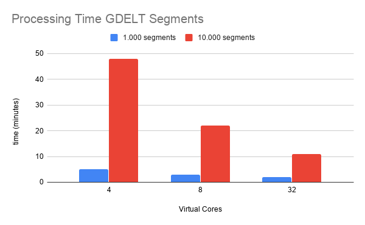

# Processing the GDELT dataset on AWS
In this blog post, the GDELT dataset will be evaluated on AWS elastic mapReduce (EMR). The goal is to process the dataset consisting of 157378 segments on 20 `c4.8xlarge` core nodes in under 30 minutes. Herefore, several steps will be performed to test the code.

## Tweaking the code to run on AWS
- Move .jar and segments to s3
- Remove .master('local') from code
- Change paths to s3
- Option to read segments directly form GDELT s3

## Processing 100 segments
After adapting the code to work in the AWS environment, a test run was performed on 100 segments using 3 `m4.large` machines (master and 2 nodes). The resulting .json file can be seen below.

```
{"date":"2015-02-20","collect_list(named_struct(NamePlaceholder(), topic, NamePlaceholder(), count))":[{"topic":"United States","count":1975},{"topic":"Islamic State","count":1958},{"topic":"New York","count":1395},{"topic":"Cyclone Marcia","count":935},{"topic":"Los Angeles","count":823},{"topic":"United Kingdom","count":775},{"topic":"White House","count":713},{"topic":"Associated Press","count":702},{"topic":"Practice Wrestling Room","count":630},{"topic":"Softball Spring Practice Varsity","count":558}]}

{"date":"2015-02-19","collect_list(named_struct(NamePlaceholder(), topic, NamePlaceholder(), count))":[{"topic":"United States","count":20335},{"topic":"Islamic State","count":15411},{"topic":"New York","count":13131},{"topic":"United Kingdom","count":12926},{"topic":"White House","count":8622},{"topic":"Los Angeles","count":7125},{"topic":"Practice Wrestling Room","count":5810},{"topic":"Associated Press","count":5744},{"topic":"New Zealand","count":5509},{"topic":"Softball Spring Practice Varsity","count":5173}]}

{"date":"2015-02-18","collect_list(named_struct(NamePlaceholder(), topic, NamePlaceholder(), count))":[{"topic":"Islamic State","count":1787},{"topic":"United States","count":1210},{"topic":"New York","count":727},{"topic":"White House","count":489},{"topic":"Los Angeles","count":424},{"topic":"Associated Press","count":385},{"topic":"New Zealand","count":353},{"topic":"United Kingdom","count":325},{"topic":"Jeb Bush","count":298},{"topic":"Practice Wrestling Room","count":280}]}
```

From this .json file it can be seen that all the segments of 19-02-2015 have been processed, while this is probably not the case for 18-02 and 20-02 since these counts are lower.


After this preliminary test, it is time to scale up to more segments.

## Processing 1000 segments

Now, the same test is performed with 1000 segments using 3 `m4.large` machines (master and 2 nodes). The step in EMR took 6 minutes to run. The resulting .json file can be seen below.

```
{"date":"2015-02-25","collect_list(named_struct(NamePlaceholder(), topic, NamePlaceholder(), count))":[{"topic":"United States","count":24353},{"topic":"United Kingdom","count":15669},{"topic":"New York","count":14434},{"topic":"Islamic State","count":13650},{"topic":"White House","count":8128},{"topic":"Los Angeles","count":6486},{"topic":"New Zealand","count":6325},{"topic":"Practice Wrestling Room","count":6303},{"topic":"Homeland Security","count":5719},{"topic":"Softball Spring Practice Varsity","count":5543}]}
{"date":"2015-03-01","collect_list(named_struct(NamePlaceholder(), topic, NamePlaceholder(), count))":[{"topic":"United States","count":4579},{"topic":"New York","count":3059},{"topic":"Practice Wrestling Room","count":2944},{"topic":"Softball Spring Practice Varsity","count":2530},{"topic":"United Kingdom","count":2463},{"topic":"Islamic State","count":2289},{"topic":"National Weather Service","count":1977},{"topic":"Sri Lanka","count":1623},{"topic":"Sydney Morning","count":1539},{"topic":"White House","count":1475}]}
{"date":"2015-02-28","collect_list(named_struct(NamePlaceholder(), topic, NamePlaceholder(), count))":[{"topic":"United States","count":12591},{"topic":"Islamic State","count":9276},{"topic":"New York","count":9068},{"topic":"Homeland Security","count":6107},{"topic":"New Zealand","count":5966},{"topic":"Boris Nemtsov","count":5910},{"topic":"Practice Wrestling Room","count":5722},{"topic":"United Kingdom","count":5514},{"topic":"White House","count":5077},{"topic":"Softball Spring Practice Varsity","count":4921}]}
{"date":"2015-02-20","collect_list(named_struct(NamePlaceholder(), topic, NamePlaceholder(), count))":[{"topic":"United States","count":19556},{"topic":"New York","count":15151},{"topic":"Islamic State","count":12975},{"topic":"United Kingdom","count":12135},{"topic":"Los Angeles","count":8387},{"topic":"White House","count":8286},{"topic":"Practice Wrestling Room","count":6588},{"topic":"Softball Spring Practice Varsity","count":5828},{"topic":"Sydney Morning","count":5111},{"topic":"New Zealand","count":4785}]}
{"date":"2015-02-24","collect_list(named_struct(NamePlaceholder(), topic, NamePlaceholder(), count))":[{"topic":"United States","count":22268},{"topic":"New York","count":15315},{"topic":"United Kingdom","count":14653},{"topic":"Islamic State","count":14008},{"topic":"White House","count":8079},{"topic":"New Zealand","count":7824},{"topic":"Practice Wrestling Room","count":6465},{"topic":"Los Angeles","count":6321},{"topic":"Homeland Security","count":6179},{"topic":"World Cup","count":5874}]}
{"date":"2015-02-23","collect_list(named_struct(NamePlaceholder(), topic, NamePlaceholder(), count))":[{"topic":"United States","count":22936},{"topic":"United Kingdom","count":12915},{"topic":"Islamic State","count":12617},{"topic":"New York","count":12229},{"topic":"Academy Awards","count":11723},{"topic":"White House","count":8159},{"topic":"Practice Wrestling Room","count":6528},{"topic":"Los Angeles","count":5843},{"topic":"Softball Spring Practice Varsity","count":5760},{"topic":"Neil Patrick Harris","count":5633}]}
{"date":"2015-02-27","collect_list(named_struct(NamePlaceholder(), topic, NamePlaceholder(), count))":[{"topic":"United States","count":21917},{"topic":"New York","count":16012},{"topic":"United Kingdom","count":14617},{"topic":"Islamic State","count":14063},{"topic":"White House","count":8565},{"topic":"Latin America","count":7958},{"topic":"New Zealand","count":7269},{"topic":"Star Trek","count":7211},{"topic":"Associated Press","count":6825},{"topic":"Notre Dame","count":6476}]}
{"date":"2015-02-26","collect_list(named_struct(NamePlaceholder(), topic, NamePlaceholder(), count))":[{"topic":"United States","count":22845},{"topic":"Islamic State","count":20027},{"topic":"New York","count":17983},{"topic":"United Kingdom","count":17486},{"topic":"White House","count":8138},{"topic":"Practice Wrestling Room","count":6336},{"topic":"New Zealand","count":5734},{"topic":"North Carolina","count":5520},{"topic":"Softball Spring Practice Varsity","count":5505},{"topic":"President Barack Obama","count":5318}]}
{"date":"2015-02-19","collect_list(named_struct(NamePlaceholder(), topic, NamePlaceholder(), count))":[{"topic":"United States","count":20335},{"topic":"Islamic State","count":15411},{"topic":"New York","count":13131},{"topic":"United Kingdom","count":12926},{"topic":"White House","count":8622},{"topic":"Los Angeles","count":7125},{"topic":"Practice Wrestling Room","count":5810},{"topic":"Associated Press","count":5744},{"topic":"New Zealand","count":5509},{"topic":"Softball Spring Practice Varsity","count":5173}]}
{"date":"2015-02-18","collect_list(named_struct(NamePlaceholder(), topic, NamePlaceholder(), count))":[{"topic":"Islamic State","count":1787},{"topic":"United States","count":1210},{"topic":"New York","count":727},{"topic":"White House","count":489},{"topic":"Los Angeles","count":424},{"topic":"Associated Press","count":385},{"topic":"New Zealand","count":353},{"topic":"United Kingdom","count":325},{"topic":"Jeb Bush","count":298},{"topic":"Practice Wrestling Room","count":280}]}
{"date":"2015-02-22","collect_list(named_struct(NamePlaceholder(), topic, NamePlaceholder(), count))":[{"topic":"United States","count":10495},{"topic":"Islamic State","count":8726},{"topic":"New York","count":8279},{"topic":"United Kingdom","count":6547},{"topic":"Practice Wrestling Room","count":6460},{"topic":"Softball Spring Practice Varsity","count":5700},{"topic":"Associated Press","count":4114},{"topic":"Los Angeles","count":3927},{"topic":"President Barack Obama","count":3484},{"topic":"Sydney Morning","count":3202}]}
{"date":"2015-02-21","collect_list(named_struct(NamePlaceholder(), topic, NamePlaceholder(), count))":[{"topic":"United States","count":11218},{"topic":"New York","count":8040},{"topic":"Practice Wrestling Room","count":6561},{"topic":"Islamic State","count":6545},{"topic":"Los Angeles","count":6386},{"topic":"White House","count":5853},{"topic":"Softball Spring Practice Varsity","count":5793},{"topic":"United Kingdom","count":5417},{"topic":"Sydney Morning","count":4813},{"topic":"Prime Minister","count":4619}]}
```


## Processing 10.000 segments

Similarly, this test was performed with 10.000 segments using 3 `m4.4xlarge` machines (master and 2 nodes). The resulting .json file can be seen below.

```
{"date":"2015-03-09","collect_list(named_struct(NamePlaceholder(), topic, NamePlaceholder(), count))":[{"topic":"United States","count":21225},{"topic":"New York","count":14976},{"topic":"Islamic State","count":14757},{"topic":"United Kingdom","count":13611},{"topic":"Apple Watch","count":13338},{"topic":"White House","count":6758},{"topic":"Boko Haram","count":6566},{"topic":"Practice Wrestling Room","count":5760},{"topic":"Middle East","count":5378},{"topic":"Associated Press","count":5221}]}
{"date":"2015-05-19","collect_list(named_struct(NamePlaceholder(), topic, NamePlaceholder(), count))":[{"topic":"United States","count":21617},{"topic":"New York","count":15013},{"topic":"Islamic State","count":14138},{"topic":"United Kingdom","count":13651},{"topic":"Twin Peaks","count":7526},{"topic":"State Department","count":7416},{"topic":"White House","count":7124},{"topic":"Middle East","count":5499},{"topic":"Associated Press","count":4738},{"topic":"New Zealand","count":4344}]}
{"date":"2015-04-09","collect_list(named_struct(NamePlaceholder(), topic, NamePlaceholder(), count))":[{"topic":"United States","count":22424},{"topic":"New York","count":14369},{"topic":"United Kingdom","count":12303},{"topic":"White House","count":10019},{"topic":"Associated Press","count":9797},{"topic":"North Charleston","count":9601},{"topic":"South Carolina","count":7703},{"topic":"Islamic State","count":6834},{"topic":"Hong Kong","count":5293},{"topic":"High School","count":5092}]}
{"date":"2015-03-12","collect_list(named_struct(NamePlaceholder(), topic, NamePlaceholder(), count))":[{"topic":"United States","count":21663},{"topic":"United Kingdom","count":15643},{"topic":"Islamic State","count":14822},{"topic":"New York","count":13693},{"topic":"Justice Department","count":13096},{"topic":"White House","count":9569},{"topic":"Associated Press","count":8621},{"topic":"Louis County","count":7274},{"topic":"Practice Wrestling Room","count":5568},{"topic":"New Zealand","count":5521}]}
{"date":"2015-03-16","collect_list(named_struct(NamePlaceholder(), topic, NamePlaceholder(), count))":[{"topic":"United States","count":24150},{"topic":"New York","count":17159},{"topic":"United Kingdom","count":13166},{"topic":"Islamic State","count":10367},{"topic":"New Zealand","count":9388},{"topic":"Los Angeles","count":9050},{"topic":"Robert Durst","count":7587},{"topic":"Port Vila","count":7017},{"topic":"New Orleans","count":5990},{"topic":"White House","count":5971}]}
{"date":"2015-04-01","collect_list(named_struct(NamePlaceholder(), topic, NamePlaceholder(), count))":[{"topic":"United States","count":23963},{"topic":"New York","count":14480},{"topic":"United Kingdom","count":13194},{"topic":"White House","count":7913},{"topic":"Islamic State","count":7170},{"topic":"Los Angeles","count":6806},{"topic":"Middle East","count":6462},{"topic":"Associated Press","count":6154},{"topic":"Saudi Arabia","count":5884},{"topic":"New Zealand","count":4984}]}
{"date":"2015-04-24","collect_list(named_struct(NamePlaceholder(), topic, NamePlaceholder(), count))":[{"topic":"United States","count":20845},{"topic":"United Kingdom","count":17215},{"topic":"New York","count":14845},{"topic":"New Zealand","count":8924},{"topic":"Time Warner Cable","count":8401},{"topic":"White House","count":8010},{"topic":"Associated Press","count":7525},{"topic":"Islamic State","count":7185},{"topic":"Apple Watch","count":6853},{"topic":"Anzac Day","count":6838}]}
{"date":"2015-04-19","collect_list(named_struct(NamePlaceholder(), topic, NamePlaceholder(), count))":[{"topic":"United States","count":10147},{"topic":"Islamic State","count":9112},{"topic":"New York","count":7288},{"topic":"United Kingdom","count":5411},{"topic":"New Hampshire","count":4282},{"topic":"European Union","count":4228},{"topic":"Oklahoma City","count":3905},{"topic":"Middle East","count":3769},{"topic":"South Africa","count":3739},{"topic":"Sydney Morning","count":3632}]}
{"date":"2015-05-16","collect_list(named_struct(NamePlaceholder(), topic, NamePlaceholder(), count))":[{"topic":"United States","count":12641},{"topic":"Islamic State","count":8396},{"topic":"New York","count":8159},{"topic":"Sweet Briar","count":5301},{"topic":"United Kingdom","count":5140},{"topic":"High School","count":4625},{"topic":"White House","count":4483},{"topic":"Associated Press","count":4408},{"topic":"New York City","count":3792},{"topic":"New Jersey","count":3756}]}
{"date":"2015-02-25","collect_list(named_struct(NamePlaceholder(), topic, NamePlaceholder(), count))":[{"topic":"United States","count":24353},{"topic":"United Kingdom","count":15669},{"topic":"New York","count":14434},{"topic":"Islamic State","count":13650},{"topic":"White House","count":8128},{"topic":"Los Angeles","count":6486},{"topic":"New Zealand","count":6325},{"topic":"Practice Wrestling Room","count":6303},{"topic":"Homeland Security","count":5719},{"topic":"Softball Spring Practice Varsity","count":5543}]}
{"date":"2015-03-21","collect_list(named_struct(NamePlaceholder(), topic, NamePlaceholder(), count))":[{"topic":"United States","count":13524},{"topic":"New York","count":9167},{"topic":"Islamic State","count":8001},{"topic":"United Kingdom","count":5533},{"topic":"Associated Press","count":5343},{"topic":"Practice Wrestling Room","count":4969},{"topic":"High School","count":4765},{"topic":"World Cup","count":4466},{"topic":"Los Angeles","count":4338},{"topic":"New Orleans","count":4115}]}
{"date":"2015-04-08","collect_list(named_struct(NamePlaceholder(), topic, NamePlaceholder(), count))":[{"topic":"United States","count":23304},{"topic":"New York","count":14750},{"topic":"United Kingdom","count":11947},{"topic":"South Carolina","count":11772},{"topic":"White House","count":10760},{"topic":"North Charleston","count":9858},{"topic":"Saudi Arabia","count":6285},{"topic":"Justice Department","count":6206},{"topic":"Islamic State","count":6107},{"topic":"Los Angeles","count":6000}]}
{"date":"2015-05-03","collect_list(named_struct(NamePlaceholder(), topic, NamePlaceholder(), count))":[{"topic":"Freddie Gray","count":15914},{"topic":"New York","count":9058},{"topic":"United States","count":8292},{"topic":"Manny Pacquiao","count":6988},{"topic":"Boko Haram","count":6654},{"topic":"Floyd Mayweather","count":6084},{"topic":"Associated Press","count":5982},{"topic":"United Kingdom","count":5878},{"topic":"New York City","count":5099},{"topic":"Nine Network","count":5036}]}
{"date":"2015-04-22","collect_list(named_struct(NamePlaceholder(), topic, NamePlaceholder(), count))":[{"topic":"United States","count":22340},{"topic":"New York","count":15754},{"topic":"United Kingdom","count":11895},{"topic":"Saudi Arabia","count":8069},{"topic":"Earth Day","count":7832},{"topic":"Islamic State","count":7773},{"topic":"White House","count":7641},{"topic":"South Africa","count":7131},{"topic":"European Union","count":6026},{"topic":"Associated Press","count":5953}]}
{"date":"2015-04-15","collect_list(named_struct(NamePlaceholder(), topic, NamePlaceholder(), count))":[{"topic":"United States","count":20627},{"topic":"New York","count":13466},{"topic":"United Kingdom","count":10866},{"topic":"White House","count":9755},{"topic":"Islamic State","count":6469},{"topic":"Sydney Morning","count":5676},{"topic":"New Zealand","count":5272},{"topic":"Supreme Court","count":5050},{"topic":"Middle East","count":4946},{"topic":"European Union","count":4672}]}
{"date":"2015-04-16","collect_list(named_struct(NamePlaceholder(), topic, NamePlaceholder(), count))":[{"topic":"United States","count":20790},{"topic":"New York","count":15042},{"topic":"United Kingdom","count":11910},{"topic":"White House","count":7001},{"topic":"Saudi Arabia","count":6852},{"topic":"Supreme Court","count":6129},{"topic":"Middle East","count":5325},{"topic":"Islamic State","count":5221},{"topic":"High School","count":5013},{"topic":"South Africa","count":4950}]}
{"date":"2015-03-15","collect_list(named_struct(NamePlaceholder(), topic, NamePlaceholder(), count))":[{"topic":"United States","count":11665},{"topic":"New York","count":8407},{"topic":"Islamic State","count":8028},{"topic":"Port Vila","count":6813},{"topic":"New Zealand","count":6589},{"topic":"United Kingdom","count":5454},{"topic":"Practice Wrestling Room","count":5376},{"topic":"Softball Spring Practice Varsity","count":4320},{"topic":"Cyclone Pam","count":4255},{"topic":"Sydney Morning","count":4156}]}
{"date":"2015-03-01","collect_list(named_struct(NamePlaceholder(), topic, NamePlaceholder(), count))":[{"topic":"United States","count":11653},{"topic":"Islamic State","count":9139},{"topic":"New York","count":7451},{"topic":"Practice Wrestling Room","count":6144},{"topic":"United Kingdom","count":5738},{"topic":"Softball Spring Practice Varsity","count":5280},{"topic":"Boris Nemtsov","count":4215},{"topic":"White House","count":4013},{"topic":"Prime Minister","count":3498},{"topic":"Sydney Morning","count":3435}]}
{"date":"2015-04-20","collect_list(named_struct(NamePlaceholder(), topic, NamePlaceholder(), count))":[{"topic":"United States","count":17220},{"topic":"United Kingdom","count":14023},{"topic":"New York","count":13756},{"topic":"Islamic State","count":9614},{"topic":"South Africa","count":7356},{"topic":"European Union","count":6810},{"topic":"New Zealand","count":6707},{"topic":"Middle East","count":5706},{"topic":"Boston Marathon","count":5158},{"topic":"White House","count":5058}]}
{"date":"2015-05-09","collect_list(named_struct(NamePlaceholder(), topic, NamePlaceholder(), count))":[{"topic":"North Korea","count":14876},{"topic":"United States","count":13177},{"topic":"South Carolina","count":10871},{"topic":"United Kingdom","count":9068},{"topic":"New York","count":7804},{"topic":"South Korea","count":5522},{"topic":"Islamic State","count":5415},{"topic":"World War","count":5139},{"topic":"High School","count":4959},{"topic":"Associated Press","count":4442}]}
{"date":"2015-05-29","collect_list(named_struct(NamePlaceholder(), topic, NamePlaceholder(), count))":[{"topic":"United States","count":19671},{"topic":"Sepp Blatter","count":13892},{"topic":"Prince Ali","count":13757},{"topic":"New York","count":9989},{"topic":"World Cup","count":9865},{"topic":"United Kingdom","count":9300},{"topic":"National Weather Service","count":8715},{"topic":"Islamic State","count":7630},{"topic":"Associated Press","count":4814},{"topic":"French Open","count":4225}]}
{"date":"2015-02-28","collect_list(named_struct(NamePlaceholder(), topic, NamePlaceholder(), count))":[{"topic":"United States","count":12591},{"topic":"Islamic State","count":9276},{"topic":"New York","count":9068},{"topic":"Homeland Security","count":6107},{"topic":"New Zealand","count":5966},{"topic":"Boris Nemtsov","count":5910},{"topic":"Practice Wrestling Room","count":5722},{"topic":"United Kingdom","count":5514},{"topic":"White House","count":5077},{"topic":"Softball Spring Practice Varsity","count":4921}]}
{"date":"2015-03-05","collect_list(named_struct(NamePlaceholder(), topic, NamePlaceholder(), count))":[{"topic":"United States","count":24265},{"topic":"New York","count":21194},{"topic":"United Kingdom","count":14559},{"topic":"State Department","count":11801},{"topic":"South Korea","count":11707},{"topic":"White House","count":8641},{"topic":"North Korea","count":7490},{"topic":"Associated Press","count":7395},{"topic":"Supreme Court","count":7161},{"topic":"Islamic State","count":7071}]}
{"date":"2015-03-28","collect_list(named_struct(NamePlaceholder(), topic, NamePlaceholder(), count))":[{"topic":"United States","count":10201},{"topic":"New York","count":6946},{"topic":"Saudi Arabia","count":6809},{"topic":"United Kingdom","count":5788},{"topic":"Boko Haram","count":4913},{"topic":"High School","count":4803},{"topic":"Practice Wrestling Room","count":4637},{"topic":"Associated Press","count":4514},{"topic":"New Zealand","count":3863},{"topic":"World Cup","count":3675}]}
{"date":"2015-04-23","collect_list(named_struct(NamePlaceholder(), topic, NamePlaceholder(), count))":[{"topic":"United States","count":24279},{"topic":"New York","count":17149},{"topic":"White House","count":12590},{"topic":"United Kingdom","count":11127},{"topic":"Islamic State","count":8174},{"topic":"Associated Press","count":7064},{"topic":"President Barack Obama","count":6830},{"topic":"New Zealand","count":6725},{"topic":"Saudi Arabia","count":6587},{"topic":"Justice Department","count":6360}]}
{"date":"2015-02-20","collect_list(named_struct(NamePlaceholder(), topic, NamePlaceholder(), count))":[{"topic":"United States","count":19556},{"topic":"New York","count":15151},{"topic":"Islamic State","count":12975},{"topic":"United Kingdom","count":12135},{"topic":"Los Angeles","count":8387},{"topic":"White House","count":8286},{"topic":"Practice Wrestling Room","count":6588},{"topic":"Softball Spring Practice Varsity","count":5828},{"topic":"Sydney Morning","count":5111},{"topic":"New Zealand","count":4785}]}
{"date":"2015-04-25","collect_list(named_struct(NamePlaceholder(), topic, NamePlaceholder(), count))":[{"topic":"United States","count":11857},{"topic":"New Zealand","count":7985},{"topic":"New York","count":7923},{"topic":"Kathmandu Valley","count":7069},{"topic":"Freddie Gray","count":5895},{"topic":"Associated Press","count":5623},{"topic":"Anzac Day","count":5499},{"topic":"World War","count":5351},{"topic":"United Kingdom","count":5198},{"topic":"High School","count":4864}]}
{"date":"2015-03-24","collect_list(named_struct(NamePlaceholder(), topic, NamePlaceholder(), count))":[{"topic":"United States","count":25508},{"topic":"United Kingdom","count":16001},{"topic":"New York","count":13852},{"topic":"French Alps","count":13128},{"topic":"White House","count":13004},{"topic":"Islamic State","count":10761},{"topic":"Supreme Court","count":8182},{"topic":"Associated Press","count":8161},{"topic":"New Zealand","count":6469},{"topic":"Los Angeles","count":6123}]}
{"date":"2015-04-13","collect_list(named_struct(NamePlaceholder(), topic, NamePlaceholder(), count))":[{"topic":"United States","count":19881},{"topic":"New York","count":13631},{"topic":"United Kingdom","count":9416},{"topic":"White House","count":9056},{"topic":"Saudi Arabia","count":8744},{"topic":"Hillary Clinton","count":6776},{"topic":"Hong Kong","count":5459},{"topic":"Associated Press","count":5325},{"topic":"Islamic State","count":5251},{"topic":"Middle East","count":5172}]}
{"date":"2015-02-24","collect_list(named_struct(NamePlaceholder(), topic, NamePlaceholder(), count))":[{"topic":"United States","count":22268},{"topic":"New York","count":15315},{"topic":"United Kingdom","count":14653},{"topic":"Islamic State","count":14008},{"topic":"White House","count":8079},{"topic":"New Zealand","count":7824},{"topic":"Practice Wrestling Room","count":6465},{"topic":"Los Angeles","count":6321},{"topic":"Homeland Security","count":6179},{"topic":"World Cup","count":5874}]}
{"date":"2015-05-22","collect_list(named_struct(NamePlaceholder(), topic, NamePlaceholder(), count))":[{"topic":"United States","count":18430},{"topic":"United Kingdom","count":14077},{"topic":"New York","count":14054},{"topic":"Islamic State","count":13276},{"topic":"Associated Press","count":10714},{"topic":"Memorial Day","count":10320},{"topic":"Saudi Arabia","count":6856},{"topic":"State Department","count":5946},{"topic":"White House","count":5847},{"topic":"Sydney Morning","count":5421}]}
{"date":"2015-03-02","collect_list(named_struct(NamePlaceholder(), topic, NamePlaceholder(), count))":[{"topic":"United States","count":22382},{"topic":"Islamic State","count":15645},{"topic":"United Kingdom","count":15483},{"topic":"New York","count":13039},{"topic":"White House","count":7573},{"topic":"Practice Wrestling Room","count":6080},{"topic":"New Zealand","count":6043},{"topic":"Sydney Morning","count":5315},{"topic":"Supreme Court","count":5274},{"topic":"Softball Spring Practice Varsity","count":5225}]}
{"date":"2015-04-17","collect_list(named_struct(NamePlaceholder(), topic, NamePlaceholder(), count))":[{"topic":"United States","count":19579},{"topic":"New York","count":13884},{"topic":"United Kingdom","count":9377},{"topic":"Islamic State","count":7781},{"topic":"White House","count":7452},{"topic":"New Hampshire","count":5941},{"topic":"South Africa","count":5609},{"topic":"Sydney Morning","count":5456},{"topic":"Associated Press","count":5346},{"topic":"High School","count":4900}]}
{"date":"2015-02-23","collect_list(named_struct(NamePlaceholder(), topic, NamePlaceholder(), count))":[{"topic":"United States","count":22936},{"topic":"United Kingdom","count":12915},{"topic":"Islamic State","count":12617},{"topic":"New York","count":12229},{"topic":"Academy Awards","count":11723},{"topic":"White House","count":8159},{"topic":"Practice Wrestling Room","count":6528},{"topic":"Los Angeles","count":5843},{"topic":"Softball Spring Practice Varsity","count":5760},{"topic":"Neil Patrick Harris","count":5633}]}
{"date":"2015-03-14","collect_list(named_struct(NamePlaceholder(), topic, NamePlaceholder(), count))":[{"topic":"United States","count":10336},{"topic":"Islamic State","count":9300},{"topic":"New York","count":6543},{"topic":"United Kingdom","count":6182},{"topic":"Port Vila","count":5546},{"topic":"Blue Bell","count":5545},{"topic":"Social Security","count":5459},{"topic":"Practice Wrestling Room","count":5349},{"topic":"New Zealand","count":5014},{"topic":"Associated Press","count":4918}]}
{"date":"2015-02-26","collect_list(named_struct(NamePlaceholder(), topic, NamePlaceholder(), count))":[{"topic":"United States","count":22845},{"topic":"Islamic State","count":20027},{"topic":"New York","count":17983},{"topic":"United Kingdom","count":17486},{"topic":"White House","count":8138},{"topic":"Practice Wrestling Room","count":6336},{"topic":"New Zealand","count":5734},{"topic":"North Carolina","count":5520},{"topic":"Softball Spring Practice Varsity","count":5505},{"topic":"President Barack Obama","count":5318}]}
{"date":"2015-03-26","collect_list(named_struct(NamePlaceholder(), topic, NamePlaceholder(), count))":[{"topic":"United States","count":27186},{"topic":"Saudi Arabia","count":19281},{"topic":"New York","count":16574},{"topic":"United Kingdom","count":14604},{"topic":"Islamic State","count":11408},{"topic":"French Alps","count":10910},{"topic":"Middle East","count":9724},{"topic":"Associated Press","count":9723},{"topic":"White House","count":7049},{"topic":"New Zealand","count":6505}]}
{"date":"2015-05-24","collect_list(named_struct(NamePlaceholder(), topic, NamePlaceholder(), count))":[{"topic":"National Weather Service","count":10647},{"topic":"Islamic State","count":9639},{"topic":"United Kingdom","count":8711},{"topic":"United States","count":8271},{"topic":"Oklahoma City","count":7446},{"topic":"Memorial Day","count":6393},{"topic":"New York","count":6077},{"topic":"Oklahoma Department","count":5968},{"topic":"Wichita Falls","count":5839},{"topic":"Monaco Grand Prix","count":5565}]}
{"date":"2015-04-26","collect_list(named_struct(NamePlaceholder(), topic, NamePlaceholder(), count))":[{"topic":"Freddie Gray","count":14208},{"topic":"United States","count":10248},{"topic":"Kathmandu Valley","count":10009},{"topic":"Mount Everest","count":9482},{"topic":"United Kingdom","count":8226},{"topic":"Camden Yards","count":7581},{"topic":"City Hall","count":7126},{"topic":"Supreme Court","count":6240},{"topic":"New York","count":6107},{"topic":"New Delhi","count":4825}]}
{"date":"2015-04-30","collect_list(named_struct(NamePlaceholder(), topic, NamePlaceholder(), count))":[{"topic":"Freddie Gray","count":29617},{"topic":"United States","count":21445},{"topic":"New York","count":21388},{"topic":"United Kingdom","count":15301},{"topic":"Associated Press","count":7408},{"topic":"White House","count":7247},{"topic":"Supreme Court","count":6867},{"topic":"New Zealand","count":6414},{"topic":"Michael Brown","count":6211},{"topic":"Los Angeles","count":5330}]}
{"date":"2015-03-20","collect_list(named_struct(NamePlaceholder(), topic, NamePlaceholder(), count))":[{"topic":"United States","count":22850},{"topic":"United Kingdom","count":14559},{"topic":"New York","count":14129},{"topic":"Islamic State","count":13702},{"topic":"White House","count":9848},{"topic":"Associated Press","count":8976},{"topic":"Malcolm Fraser","count":6138},{"topic":"Prime Minister","count":6128},{"topic":"Los Angeles","count":5971},{"topic":"New Jersey","count":5806}]}
{"date":"2015-05-31","collect_list(named_struct(NamePlaceholder(), topic, NamePlaceholder(), count))":[{"topic":"United States","count":12376},{"topic":"Beau Biden","count":8953},{"topic":"National Weather Service","count":7206},{"topic":"New York","count":7076},{"topic":"United Kingdom","count":5911},{"topic":"Islamic State","count":5846},{"topic":"Joe Biden","count":4929},{"topic":"Colorado River","count":4907},{"topic":"High School","count":4810},{"topic":"White House","count":4725}]}
{"date":"2015-05-01","collect_list(named_struct(NamePlaceholder(), topic, NamePlaceholder(), count))":[{"topic":"Freddie Gray","count":33039},{"topic":"New York","count":22156},{"topic":"United States","count":17141},{"topic":"United Kingdom","count":12167},{"topic":"Associated Press","count":9506},{"topic":"New Jersey","count":9256},{"topic":"May Day","count":8021},{"topic":"Los Angeles","count":7329},{"topic":"San Francisco","count":6701},{"topic":"Attorney Marilyn Mosby","count":5912}]}
{"date":"2015-04-10","collect_list(named_struct(NamePlaceholder(), topic, NamePlaceholder(), count))":[{"topic":"United States","count":22986},{"topic":"New York","count":13278},{"topic":"United Kingdom","count":10138},{"topic":"Associated Press","count":8962},{"topic":"White House","count":7657},{"topic":"Apple Watch","count":7652},{"topic":"National Weather Service","count":7453},{"topic":"Saudi Arabia","count":6801},{"topic":"Sydney Morning","count":6051},{"topic":"North Charleston","count":5937}]}
{"date":"2015-05-15","collect_list(named_struct(NamePlaceholder(), topic, NamePlaceholder(), count))":[{"topic":"United States","count":22297},{"topic":"New York","count":16792},{"topic":"United Kingdom","count":14371},{"topic":"Associated Press","count":11702},{"topic":"Las Vegas","count":7709},{"topic":"White House","count":7616},{"topic":"Islamic State","count":7342},{"topic":"Dzhokhar Tsarnaev","count":6679},{"topic":"Sydney Morning","count":6109},{"topic":"New York City","count":5965}]}
{"date":"2015-02-22","collect_list(named_struct(NamePlaceholder(), topic, NamePlaceholder(), count))":[{"topic":"United States","count":10495},{"topic":"Islamic State","count":8726},{"topic":"New York","count":8279},{"topic":"United Kingdom","count":6547},{"topic":"Practice Wrestling Room","count":6460},{"topic":"Softball Spring Practice Varsity","count":5700},{"topic":"Associated Press","count":4114},{"topic":"Los Angeles","count":3927},{"topic":"President Barack Obama","count":3484},{"topic":"Sydney Morning","count":3202}]}
{"date":"2015-05-20","collect_list(named_struct(NamePlaceholder(), topic, NamePlaceholder(), count))":[{"topic":"United States","count":22976},{"topic":"New York","count":17051},{"topic":"United Kingdom","count":15920},{"topic":"Islamic State","count":11700},{"topic":"Associated Press","count":8949},{"topic":"White House","count":6906},{"topic":"Los Angeles","count":6811},{"topic":"Memorial Day","count":6646},{"topic":"Twin Peaks","count":5656},{"topic":"North Korea","count":5611}]}
{"date":"2015-03-31","collect_list(named_struct(NamePlaceholder(), topic, NamePlaceholder(), count))":[{"topic":"United States","count":24241},{"topic":"New York","count":14296},{"topic":"United Kingdom","count":12766},{"topic":"White House","count":7208},{"topic":"Islamic State","count":6400},{"topic":"Saudi Arabia","count":6356},{"topic":"Associated Press","count":6120},{"topic":"New Zealand","count":5630},{"topic":"Middle East","count":5134},{"topic":"South Africa","count":4998}]}
{"date":"2015-05-27","collect_list(named_struct(NamePlaceholder(), topic, NamePlaceholder(), count))":[{"topic":"United States","count":26569},{"topic":"New York","count":16763},{"topic":"Islamic State","count":15010},{"topic":"United Kingdom","count":14487},{"topic":"Associated Press","count":9203},{"topic":"Sepp Blatter","count":8566},{"topic":"World Cup","count":7709},{"topic":"Blanco River","count":6818},{"topic":"Los Angeles","count":6426},{"topic":"Supreme Court","count":5601}]}
{"date":"2015-03-30","collect_list(named_struct(NamePlaceholder(), topic, NamePlaceholder(), count))":[{"topic":"United States","count":20427},{"topic":"New York","count":13340},{"topic":"United Kingdom","count":12773},{"topic":"Saudi Arabia","count":7304},{"topic":"Final Four","count":6841},{"topic":"South Africa","count":6690},{"topic":"Associated Press","count":5887},{"topic":"White House","count":5807},{"topic":"New Zealand","count":5382},{"topic":"Fort Meade","count":5352}]}
{"date":"2015-04-05","collect_list(named_struct(NamePlaceholder(), topic, NamePlaceholder(), count))":[{"topic":"United States","count":8627},{"topic":"Blue Devils","count":6092},{"topic":"New York","count":6056},{"topic":"Islamic State","count":5924},{"topic":"High School","count":4930},{"topic":"Michigan State","count":4551},{"topic":"United Kingdom","count":4437},{"topic":"Final Four","count":4389},{"topic":"Practice Wrestling Room","count":4224},{"topic":"Easter Sunday","count":3636}]}
{"date":"2015-03-03","collect_list(named_struct(NamePlaceholder(), topic, NamePlaceholder(), count))":[{"topic":"United States","count":28582},{"topic":"United Kingdom","count":13791},{"topic":"New York","count":12996},{"topic":"Islamic State","count":11107},{"topic":"White House","count":10175},{"topic":"President Barack Obama","count":6688},{"topic":"Supreme Court","count":6468},{"topic":"Middle East","count":6400},{"topic":"Los Angeles","count":6210},{"topic":"New Zealand","count":5872}]}
{"date":"2015-05-30","collect_list(named_struct(NamePlaceholder(), topic, NamePlaceholder(), count))":[{"topic":"United States","count":16647},{"topic":"National Weather Service","count":10387},{"topic":"New York","count":7724},{"topic":"Colorado River","count":6980},{"topic":"World Cup","count":6353},{"topic":"Associated Press","count":5585},{"topic":"Islamic State","count":5055},{"topic":"South China Sea","count":4869},{"topic":"High School","count":4665},{"topic":"United Kingdom","count":4514}]}
{"date":"2015-03-06","collect_list(named_struct(NamePlaceholder(), topic, NamePlaceholder(), count))":[{"topic":"United States","count":18326},{"topic":"New York","count":17217},{"topic":"United Kingdom","count":11685},{"topic":"Islamic State","count":10617},{"topic":"Los Angeles","count":7178},{"topic":"South Korea","count":7085},{"topic":"State Department","count":6464},{"topic":"Associated Press","count":6109},{"topic":"Sydney Morning","count":5884},{"topic":"Hong Kong","count":5740}]}
{"date":"2015-05-07","collect_list(named_struct(NamePlaceholder(), topic, NamePlaceholder(), count))":[{"topic":"Oklahoma City","count":22971},{"topic":"United States","count":21484},{"topic":"United Kingdom","count":17921},{"topic":"New York","count":15057},{"topic":"National Weather Service","count":10628},{"topic":"Islamic State","count":10268},{"topic":"Saudi Arabia","count":8213},{"topic":"Associated Press","count":6745},{"topic":"White House","count":5813},{"topic":"Labour Party","count":5688}]}
{"date":"2015-05-10","collect_list(named_struct(NamePlaceholder(), topic, NamePlaceholder(), count))":[{"topic":"United States","count":10831},{"topic":"South Carolina","count":8945},{"topic":"Associated Press","count":7218},{"topic":"United Kingdom","count":7177},{"topic":"New York","count":6958},{"topic":"North Texas","count":6957},{"topic":"National Weather Service","count":6711},{"topic":"South Dakota","count":5105},{"topic":"High School","count":4775},{"topic":"Indian Point","count":3988}]}
{"date":"2015-03-11","collect_list(named_struct(NamePlaceholder(), topic, NamePlaceholder(), count))":[{"topic":"United States","count":20274},{"topic":"United Kingdom","count":15283},{"topic":"New York","count":14500},{"topic":"Islamic State","count":12176},{"topic":"State Department","count":10562},{"topic":"Associated Press","count":9568},{"topic":"White House","count":6980},{"topic":"New Zealand","count":6156},{"topic":"Prime Minister","count":6006},{"topic":"Supreme Court","count":5839}]}
{"date":"2015-04-07","collect_list(named_struct(NamePlaceholder(), topic, NamePlaceholder(), count))":[{"topic":"United States","count":20738},{"topic":"New York","count":14372},{"topic":"United Kingdom","count":11785},{"topic":"White House","count":10691},{"topic":"Rolling Stone","count":9644},{"topic":"Blue Devils","count":8292},{"topic":"Islamic State","count":6612},{"topic":"Saudi Arabia","count":5511},{"topic":"Associated Press","count":5434},{"topic":"Rand Paul","count":5367}]}
{"date":"2015-04-28","collect_list(named_struct(NamePlaceholder(), topic, NamePlaceholder(), count))":[{"topic":"Freddie Gray","count":37360},{"topic":"United States","count":22711},{"topic":"New York","count":16049},{"topic":"Supreme Court","count":13899},{"topic":"United Kingdom","count":13543},{"topic":"White House","count":12461},{"topic":"National Guard","count":11484},{"topic":"Larry Hogan","count":8267},{"topic":"Islamic State","count":6559},{"topic":"Andrew Chan","count":6393}]}
{"date":"2015-05-25","collect_list(named_struct(NamePlaceholder(), topic, NamePlaceholder(), count))":[{"topic":"Memorial Day","count":16184},{"topic":"Islamic State","count":13878},{"topic":"United States","count":12610},{"topic":"New York","count":11226},{"topic":"San Marcos","count":9302},{"topic":"United Kingdom","count":8892},{"topic":"Blanco River","count":8276},{"topic":"Associated Press","count":7933},{"topic":"Central Texas","count":7631},{"topic":"National Weather Service","count":5433}]}
{"date":"2015-05-06","collect_list(named_struct(NamePlaceholder(), topic, NamePlaceholder(), count))":[{"topic":"United States","count":23313},{"topic":"United Kingdom","count":16518},{"topic":"New York","count":14074},{"topic":"Islamic State","count":11315},{"topic":"Saudi Arabia","count":7714},{"topic":"Associated Press","count":6789},{"topic":"White House","count":5829},{"topic":"Salman Khan","count":5401},{"topic":"Middle East","count":5216},{"topic":"European Union","count":5075}]}
{"date":"2015-03-22","collect_list(named_struct(NamePlaceholder(), topic, NamePlaceholder(), count))":[{"topic":"United States","count":12918},{"topic":"Islamic State","count":9572},{"topic":"New York","count":8755},{"topic":"United Kingdom","count":6220},{"topic":"Practice Wrestling Room","count":4992},{"topic":"White House","count":4931},{"topic":"High School","count":4817},{"topic":"Associated Press","count":3926},{"topic":"Softball Spring Practice Varsity","count":3840},{"topic":"Nine Network","count":3766}]}
{"date":"2015-04-18","collect_list(named_struct(NamePlaceholder(), topic, NamePlaceholder(), count))":[{"topic":"Islamic State","count":11785},{"topic":"United States","count":11343},{"topic":"New York","count":8314},{"topic":"White House","count":5653},{"topic":"New Hampshire","count":5634},{"topic":"Sydney Morning","count":4754},{"topic":"United Kingdom","count":4500},{"topic":"South Africa","count":4456},{"topic":"Associated Press","count":3998},{"topic":"San Francisco","count":3121}]}
{"date":"2015-05-18","collect_list(named_struct(NamePlaceholder(), topic, NamePlaceholder(), count))":[{"topic":"United States","count":21858},{"topic":"New York","count":18184},{"topic":"Islamic State","count":15863},{"topic":"United Kingdom","count":12929},{"topic":"Twin Peaks","count":12312},{"topic":"Northeast Corridor","count":8982},{"topic":"White House","count":8827},{"topic":"North Korea","count":8324},{"topic":"Associated Press","count":6632},{"topic":"South Korea","count":6414}]}
{"date":"2015-05-23","collect_list(named_struct(NamePlaceholder(), topic, NamePlaceholder(), count))":[{"topic":"United States","count":10758},{"topic":"Islamic State","count":9754},{"topic":"United Kingdom","count":8100},{"topic":"Memorial Day","count":8002},{"topic":"New York","count":7230},{"topic":"Associated Press","count":6721},{"topic":"Las Vegas","count":5375},{"topic":"High School","count":5000},{"topic":"Middle East","count":4680},{"topic":"Sydney Morning","count":4645}]}
{"date":"2015-03-19","collect_list(named_struct(NamePlaceholder(), topic, NamePlaceholder(), count))":[{"topic":"United States","count":22676},{"topic":"New York","count":15490},{"topic":"United Kingdom","count":14507},{"topic":"White House","count":12275},{"topic":"Islamic State","count":9339},{"topic":"New Zealand","count":5643},{"topic":"Supreme Court","count":5464},{"topic":"Sydney Morning","count":5460},{"topic":"Los Angeles","count":5436},{"topic":"Associated Press","count":5269}]}
{"date":"2015-03-13","collect_list(named_struct(NamePlaceholder(), topic, NamePlaceholder(), count))":[{"topic":"United States","count":20217},{"topic":"Islamic State","count":14926},{"topic":"New York","count":13021},{"topic":"United Kingdom","count":12104},{"topic":"White House","count":8438},{"topic":"Boko Haram","count":7475},{"topic":"Sri Lanka","count":7451},{"topic":"Louis County","count":7447},{"topic":"Justice Department","count":7075},{"topic":"Sydney Morning","count":6916}]}
{"date":"2015-05-21","collect_list(named_struct(NamePlaceholder(), topic, NamePlaceholder(), count))":[{"topic":"United States","count":21498},{"topic":"Islamic State","count":20128},{"topic":"New York","count":18062},{"topic":"United Kingdom","count":16369},{"topic":"Associated Press","count":9324},{"topic":"Memorial Day","count":8448},{"topic":"New Zealand","count":6927},{"topic":"Middle East","count":6644},{"topic":"White House","count":6076},{"topic":"David Letterman","count":5755}]}
{"date":"2015-06-01","collect_list(named_struct(NamePlaceholder(), topic, NamePlaceholder(), count))":[{"topic":"United States","count":21079},{"topic":"United Kingdom","count":12541},{"topic":"New York","count":11541},{"topic":"Islamic State","count":11040},{"topic":"Supreme Court","count":7158},{"topic":"White House","count":5971},{"topic":"Patriot Act","count":5738},{"topic":"South Korea","count":5518},{"topic":"French Open","count":5361},{"topic":"High School","count":4855}]}
{"date":"2015-04-11","collect_list(named_struct(NamePlaceholder(), topic, NamePlaceholder(), count))":[{"topic":"United States","count":16868},{"topic":"New York","count":8342},{"topic":"Barack Obama","count":7598},{"topic":"White House","count":7254},{"topic":"Latin America","count":5911},{"topic":"President Barack Obama","count":4970},{"topic":"North Charleston","count":4785},{"topic":"High School","count":4773},{"topic":"United Kingdom","count":4582},{"topic":"Associated Press","count":4334}]}
{"date":"2015-04-27","collect_list(named_struct(NamePlaceholder(), topic, NamePlaceholder(), count))":[{"topic":"United States","count":21280},{"topic":"Freddie Gray","count":18658},{"topic":"United Kingdom","count":14116},{"topic":"New York","count":13311},{"topic":"James Holmes","count":12000},{"topic":"Supreme Court","count":10366},{"topic":"Mount Everest","count":9990},{"topic":"White House","count":7321},{"topic":"Associated Press","count":5958},{"topic":"United Nations","count":5381}]}
{"date":"2015-04-14","collect_list(named_struct(NamePlaceholder(), topic, NamePlaceholder(), count))":[{"topic":"United States","count":22874},{"topic":"New York","count":14743},{"topic":"United Kingdom","count":11378},{"topic":"White House","count":10954},{"topic":"Boko Haram","count":9734},{"topic":"Islamic State","count":9425},{"topic":"Associated Press","count":6324},{"topic":"Los Angeles","count":5644},{"topic":"Middle East","count":5510},{"topic":"High School","count":5071}]}
{"date":"2015-03-18","collect_list(named_struct(NamePlaceholder(), topic, NamePlaceholder(), count))":[{"topic":"United States","count":22488},{"topic":"White House","count":14850},{"topic":"United Kingdom","count":14190},{"topic":"New York","count":13358},{"topic":"Islamic State","count":9817},{"topic":"Zionist Union","count":8601},{"topic":"Associated Press","count":6707},{"topic":"Los Angeles","count":6129},{"topic":"Middle East","count":5728},{"topic":"Prime Minister","count":5699}]}
{"date":"2015-04-29","collect_list(named_struct(NamePlaceholder(), topic, NamePlaceholder(), count))":[{"topic":"Freddie Gray","count":28042},{"topic":"United States","count":24067},{"topic":"New York","count":16138},{"topic":"United Kingdom","count":15800},{"topic":"White House","count":14923},{"topic":"Supreme Court","count":9706},{"topic":"Associated Press","count":7379},{"topic":"Saudi Arabia","count":7007},{"topic":"Andrew Chan","count":6947},{"topic":"Boko Haram","count":6916}]}
{"date":"2015-05-11","collect_list(named_struct(NamePlaceholder(), topic, NamePlaceholder(), count))":[{"topic":"United States","count":20877},{"topic":"United Kingdom","count":14395},{"topic":"New York","count":14090},{"topic":"White House","count":9036},{"topic":"National Weather Service","count":8550},{"topic":"Associated Press","count":7410},{"topic":"South Dakota","count":6892},{"topic":"Saudi Arabia","count":6385},{"topic":"New Zealand","count":6022},{"topic":"Supreme Court","count":4922}]}
{"date":"2015-05-05","collect_list(named_struct(NamePlaceholder(), topic, NamePlaceholder(), count))":[{"topic":"United States","count":21479},{"topic":"United Kingdom","count":17102},{"topic":"New York","count":14862},{"topic":"Islamic State","count":9351},{"topic":"Prophet Muhammad","count":7979},{"topic":"Associated Press","count":7102},{"topic":"Saudi Arabia","count":6709},{"topic":"Justice Department","count":5969},{"topic":"White House","count":5702},{"topic":"Middle East","count":5510}]}
{"date":"2015-04-02","collect_list(named_struct(NamePlaceholder(), topic, NamePlaceholder(), count))":[{"topic":"United States","count":24338},{"topic":"New York","count":15540},{"topic":"United Kingdom","count":12186},{"topic":"Associated Press","count":6672},{"topic":"Los Angeles","count":6161},{"topic":"Islamic State","count":6098},{"topic":"Saudi Arabia","count":5971},{"topic":"Garissa University College","count":5468},{"topic":"Middle East","count":5279},{"topic":"New Jersey","count":5176}]}
{"date":"2015-05-14","collect_list(named_struct(NamePlaceholder(), topic, NamePlaceholder(), count))":[{"topic":"United States","count":22083},{"topic":"New York","count":21539},{"topic":"United Kingdom","count":14153},{"topic":"White House","count":11246},{"topic":"Associated Press","count":11218},{"topic":"Saudi Arabia","count":7259},{"topic":"Islamic State","count":6722},{"topic":"New York City","count":6682},{"topic":"Supreme Court","count":6005},{"topic":"Middle East","count":5512}]}
{"date":"2015-04-06","collect_list(named_struct(NamePlaceholder(), topic, NamePlaceholder(), count))":[{"topic":"Rolling Stone","count":15844},{"topic":"United States","count":15438},{"topic":"New York","count":11196},{"topic":"Saudi Arabia","count":6767},{"topic":"United Kingdom","count":6555},{"topic":"White House","count":5721},{"topic":"Islamic State","count":4945},{"topic":"New York Times","count":4700},{"topic":"Phi Kappa Psi","count":4447},{"topic":"Middle East","count":4385}]}
{"date":"2015-05-13","collect_list(named_struct(NamePlaceholder(), topic, NamePlaceholder(), count))":[{"topic":"New York","count":28329},{"topic":"United States","count":21629},{"topic":"Associated Press","count":16529},{"topic":"New York City","count":15912},{"topic":"United Kingdom","count":15395},{"topic":"Port Richmond","count":10752},{"topic":"Islamic State","count":7977},{"topic":"White House","count":7935},{"topic":"Tony Robinson","count":6881},{"topic":"National Transportation Safety Board","count":6566}]}
{"date":"2015-04-03","collect_list(named_struct(NamePlaceholder(), topic, NamePlaceholder(), count))":[{"topic":"United States","count":19058},{"topic":"New York","count":13158},{"topic":"Coast Guard","count":11037},{"topic":"White House","count":6510},{"topic":"Associated Press","count":6473},{"topic":"United Kingdom","count":6074},{"topic":"Saudi Arabia","count":5829},{"topic":"Middle East","count":5658},{"topic":"North Carolina","count":5518},{"topic":"High School","count":5394}]}
{"date":"2015-05-12","collect_list(named_struct(NamePlaceholder(), topic, NamePlaceholder(), count))":[{"topic":"United States","count":21349},{"topic":"New York","count":16987},{"topic":"United Kingdom","count":12916},{"topic":"State Department","count":7843},{"topic":"Associated Press","count":7528},{"topic":"White House","count":6820},{"topic":"Islamic State","count":6745},{"topic":"Tony Robinson","count":5174},{"topic":"Middle East","count":5030},{"topic":"Saudi Arabia","count":4875}]}
{"date":"2015-05-02","collect_list(named_struct(NamePlaceholder(), topic, NamePlaceholder(), count))":[{"topic":"Freddie Gray","count":27866},{"topic":"New York","count":10986},{"topic":"United States","count":10863},{"topic":"Sri Lanka","count":6853},{"topic":"May Day","count":6755},{"topic":"Associated Press","count":6456},{"topic":"Attorney Marilyn","count":6431},{"topic":"Prince George","count":6268},{"topic":"Boko Haram","count":6015},{"topic":"Attorney Marilyn Mosby","count":5457}]}
{"date":"2015-03-04","collect_list(named_struct(NamePlaceholder(), topic, NamePlaceholder(), count))":[{"topic":"United States","count":27314},{"topic":"United Kingdom","count":16181},{"topic":"New York","count":14816},{"topic":"Supreme Court","count":10494},{"topic":"White House","count":9337},{"topic":"Los Angeles","count":8825},{"topic":"State Department","count":8297},{"topic":"President Barack Obama","count":7576},{"topic":"Islamic State","count":7511},{"topic":"Justice Department","count":6682}]}
{"date":"2015-03-23","collect_list(named_struct(NamePlaceholder(), topic, NamePlaceholder(), count))":[{"topic":"United States","count":21138},{"topic":"New York","count":17421},{"topic":"United Kingdom","count":13203},{"topic":"Islamic State","count":9517},{"topic":"Supreme Court","count":7759},{"topic":"White House","count":7508},{"topic":"Lee Kuan Yew","count":7195},{"topic":"New Zealand","count":6139},{"topic":"Ted Cruz","count":5476},{"topic":"Prime Minister","count":5265}]}
{"date":"2015-02-27","collect_list(named_struct(NamePlaceholder(), topic, NamePlaceholder(), count))":[{"topic":"United States","count":21917},{"topic":"New York","count":16012},{"topic":"United Kingdom","count":14617},{"topic":"Islamic State","count":14063},{"topic":"White House","count":8565},{"topic":"Latin America","count":7958},{"topic":"New Zealand","count":7269},{"topic":"Star Trek","count":7211},{"topic":"Associated Press","count":6825},{"topic":"Notre Dame","count":6476}]}
{"date":"2015-03-17","collect_list(named_struct(NamePlaceholder(), topic, NamePlaceholder(), count))":[{"topic":"United States","count":22903},{"topic":"New York","count":18736},{"topic":"United Kingdom","count":12868},{"topic":"White House","count":10075},{"topic":"Islamic State","count":8562},{"topic":"New Zealand","count":8137},{"topic":"Zionist Union","count":7678},{"topic":"Los Angeles","count":6550},{"topic":"Associated Press","count":6473},{"topic":"New Jersey","count":5657}]}
{"date":"2015-04-12","collect_list(named_struct(NamePlaceholder(), topic, NamePlaceholder(), count))":[{"topic":"United States","count":16540},{"topic":"New York","count":7934},{"topic":"White House","count":7227},{"topic":"Hillary Clinton","count":6247},{"topic":"Barack Obama","count":6088},{"topic":"Saudi Arabia","count":5185},{"topic":"High School","count":4862},{"topic":"United Kingdom","count":3973},{"topic":"Practice Wrestling Room","count":3840},{"topic":"Islamic State","count":3750}]}
{"date":"2015-06-03","collect_list(named_struct(NamePlaceholder(), topic, NamePlaceholder(), count))":[{"topic":"United States","count":10993},{"topic":"United Kingdom","count":7030},{"topic":"New York","count":6379},{"topic":"Sepp Blatter","count":5111},{"topic":"Yangtze River","count":4782},{"topic":"South Africa","count":4713},{"topic":"South Korea","count":4431},{"topic":"Eastern Star","count":4222},{"topic":"Islamic State","count":3758},{"topic":"World Cup","count":3714}]}
{"date":"2015-05-28","collect_list(named_struct(NamePlaceholder(), topic, NamePlaceholder(), count))":[{"topic":"United States","count":27519},{"topic":"New York","count":20261},{"topic":"Islamic State","count":17396},{"topic":"United Kingdom","count":17276},{"topic":"Sepp Blatter","count":12388},{"topic":"World Cup","count":8185},{"topic":"Associated Press","count":7262},{"topic":"Los Angeles","count":6816},{"topic":"National Weather Service","count":6719},{"topic":"South Africa","count":6040}]}
{"date":"2015-02-19","collect_list(named_struct(NamePlaceholder(), topic, NamePlaceholder(), count))":[{"topic":"United States","count":20335},{"topic":"Islamic State","count":15411},{"topic":"New York","count":13131},{"topic":"United Kingdom","count":12926},{"topic":"White House","count":8622},{"topic":"Los Angeles","count":7125},{"topic":"Practice Wrestling Room","count":5810},{"topic":"Associated Press","count":5744},{"topic":"New Zealand","count":5509},{"topic":"Softball Spring Practice Varsity","count":5173}]}
{"date":"2015-03-08","collect_list(named_struct(NamePlaceholder(), topic, NamePlaceholder(), count))":[{"topic":"Islamic State","count":11818},{"topic":"United States","count":9573},{"topic":"New York","count":8112},{"topic":"Boko Haram","count":7484},{"topic":"United Kingdom","count":5819},{"topic":"Practice Wrestling Room","count":5700},{"topic":"International Women","count":4895},{"topic":"Softball Spring Practice Varsity","count":4750},{"topic":"World Cup","count":4214},{"topic":"Kuala Lumpur","count":3805}]}
{"date":"2015-04-21","collect_list(named_struct(NamePlaceholder(), topic, NamePlaceholder(), count))":[{"topic":"United States","count":18732},{"topic":"United Kingdom","count":15317},{"topic":"New York","count":13117},{"topic":"Islamic State","count":8341},{"topic":"Blue Bell","count":6190},{"topic":"South Africa","count":5900},{"topic":"New Zealand","count":5884},{"topic":"Saudi Arabia","count":5598},{"topic":"White House","count":5466},{"topic":"Middle East","count":5236}]}
{"date":"2015-02-18","collect_list(named_struct(NamePlaceholder(), topic, NamePlaceholder(), count))":[{"topic":"Islamic State","count":1787},{"topic":"United States","count":1210},{"topic":"New York","count":727},{"topic":"White House","count":489},{"topic":"Los Angeles","count":424},{"topic":"Associated Press","count":385},{"topic":"New Zealand","count":353},{"topic":"United Kingdom","count":325},{"topic":"Jeb Bush","count":298},{"topic":"Practice Wrestling Room","count":280}]}
{"date":"2015-03-07","collect_list(named_struct(NamePlaceholder(), topic, NamePlaceholder(), count))":[{"topic":"Islamic State","count":11353},{"topic":"United States","count":10187},{"topic":"New York","count":7326},{"topic":"United Kingdom","count":5730},{"topic":"Justice Department","count":5226},{"topic":"New Jersey","count":4656},{"topic":"President Barack Obama","count":4643},{"topic":"Supreme Court","count":4536},{"topic":"Practice Wrestling Room","count":4268},{"topic":"Sri Lanka","count":4179}]}
{"date":"2015-05-26","collect_list(named_struct(NamePlaceholder(), topic, NamePlaceholder(), count))":[{"topic":"United States","count":20810},{"topic":"Islamic State","count":19956},{"topic":"United Kingdom","count":13643},{"topic":"New York","count":12897},{"topic":"Memorial Day","count":12438},{"topic":"Time Warner Cable","count":10297},{"topic":"Blanco River","count":9694},{"topic":"Ciudad Acuna","count":8922},{"topic":"Associated Press","count":8742},{"topic":"Central Texas","count":7142}]}
{"date":"2015-03-10","collect_list(named_struct(NamePlaceholder(), topic, NamePlaceholder(), count))":[{"topic":"United States","count":23257},{"topic":"New York","count":18679},{"topic":"United Kingdom","count":13600},{"topic":"Apple Watch","count":11702},{"topic":"White House","count":10775},{"topic":"Islamic State","count":10049},{"topic":"New Zealand","count":8651},{"topic":"State Department","count":8592},{"topic":"Supreme Court","count":6477},{"topic":"Practice Wrestling Room","count":5693}]}
{"date":"2015-03-27","collect_list(named_struct(NamePlaceholder(), topic, NamePlaceholder(), count))":[{"topic":"United States","count":21155},{"topic":"New York","count":15798},{"topic":"Saudi Arabia","count":14158},{"topic":"United Kingdom","count":13756},{"topic":"Andreas Lubitz","count":12014},{"topic":"French Alps","count":9211},{"topic":"Middle East","count":8089},{"topic":"Associated Press","count":7730},{"topic":"Islamic State","count":7570},{"topic":"New Zealand","count":5449}]}
{"date":"2015-05-04","collect_list(named_struct(NamePlaceholder(), topic, NamePlaceholder(), count))":[{"topic":"United States","count":17931},{"topic":"Prophet Muhammad","count":17290},{"topic":"New York","count":14691},{"topic":"United Kingdom","count":11034},{"topic":"Associated Press","count":10410},{"topic":"Curtis Culwell Center","count":7302},{"topic":"Islamic State","count":5855},{"topic":"New Jersey","count":5700},{"topic":"White House","count":5562},{"topic":"Star Wars","count":5273}]}
{"date":"2015-02-21","collect_list(named_struct(NamePlaceholder(), topic, NamePlaceholder(), count))":[{"topic":"United States","count":11218},{"topic":"New York","count":8040},{"topic":"Practice Wrestling Room","count":6561},{"topic":"Islamic State","count":6545},{"topic":"Los Angeles","count":6386},{"topic":"White House","count":5853},{"topic":"Softball Spring Practice Varsity","count":5793},{"topic":"United Kingdom","count":5417},{"topic":"Sydney Morning","count":4813},{"topic":"Prime Minister","count":4619}]}
{"date":"2015-03-25","collect_list(named_struct(NamePlaceholder(), topic, NamePlaceholder(), count))":[{"topic":"United States","count":22423},{"topic":"New York","count":14061},{"topic":"United Kingdom","count":13916},{"topic":"French Alps","count":13328},{"topic":"Associated Press","count":10639},{"topic":"White House","count":9269},{"topic":"Islamic State","count":8940},{"topic":"New Zealand","count":6780},{"topic":"Top Gear","count":6377},{"topic":"Supreme Court","count":5805}]}
{"date":"2015-03-29","collect_list(named_struct(NamePlaceholder(), topic, NamePlaceholder(), count))":[{"topic":"United States","count":10098},{"topic":"New York","count":7237},{"topic":"New Zealand","count":6846},{"topic":"Saudi Arabia","count":6682},{"topic":"United Kingdom","count":5729},{"topic":"High School","count":4818},{"topic":"World Cup","count":4690},{"topic":"Practice Wrestling Room","count":4608},{"topic":"Boko Haram","count":4422},{"topic":"Final Four","count":4387}]}
{"date":"2015-05-08","collect_list(named_struct(NamePlaceholder(), topic, NamePlaceholder(), count))":[{"topic":"United Kingdom","count":27994},{"topic":"United States","count":20743},{"topic":"New York","count":17860},{"topic":"Labour Party","count":16901},{"topic":"Liberal Democrats","count":16012},{"topic":"Conservative Party","count":13952},{"topic":"Scottish National Party","count":12325},{"topic":"Prime Minister David Cameron","count":10808},{"topic":"Islamic State","count":7619},{"topic":"South Carolina","count":7264}]}
{"date":"2015-04-04","collect_list(named_struct(NamePlaceholder(), topic, NamePlaceholder(), count))":[{"topic":"United States","count":9390},{"topic":"New York","count":7453},{"topic":"Associated Press","count":6199},{"topic":"Islamic State","count":5713},{"topic":"United Kingdom","count":5030},{"topic":"High School","count":4995},{"topic":"Practice Wrestling Room","count":4164},{"topic":"Saudi Arabia","count":3426},{"topic":"Sydney Morning","count":3292},{"topic":"Good Friday","count":3125}]}
{"date":"2015-06-02","collect_list(named_struct(NamePlaceholder(), topic, NamePlaceholder(), count))":[{"topic":"United States","count":20281},{"topic":"United Kingdom","count":13479},{"topic":"New York","count":13089},{"topic":"Islamic State","count":9854},{"topic":"White House","count":8145},{"topic":"Yangtze River","count":8053},{"topic":"South Korea","count":6732},{"topic":"Associated Press","count":5878},{"topic":"French Open","count":5732},{"topic":"Vanity Fair","count":5406}]}
{"date":"2015-05-17","collect_list(named_struct(NamePlaceholder(), topic, NamePlaceholder(), count))":[{"topic":"Islamic State","count":11471},{"topic":"United States","count":11339},{"topic":"New York","count":10239},{"topic":"United Kingdom","count":5175},{"topic":"High School","count":4803},{"topic":"New Zealand","count":4219},{"topic":"Associated Press","count":4119},{"topic":"Middle East","count":3933},{"topic":"American Pharoah","count":3778},{"topic":"Prime Minister","count":3304}]}
```
## Processing Time with different amounts of Virtual Cores
Below one can see an overview of the processing time of 1000 vs 10.000 segments using a `m4.large`, a `m4.xlarge` and `m4.4xlarge` respectively.



By linearly extrapolating, it could be concluded from this graph that 3 `m4.large` machines would take roughly 750 minutes. Similarly, 3 `m4.xlarge` machines would take roughly 200 minutes. Lastly,`m4.4xlarge` would process within 80 minutes. If this would turn out to be a good estimation of the runtime, scaling the virtual cores of a node from 4 to 8 (x2) has more impact on the runtime than 8 to 32 (x4). This could be due to the fact that the code is not fully parallelizable. Improvements could be done, however according to Amdahl's law a 100% parallelizable code is impossible. Therefore, runtime will not linearly decrease with doubling the amount of virtual cores. Additionaly, when looking at the figure below, it can be concluded that the load is spread quite evenly along all nodes (except the master), meaning that adding more nodes will increase performance. 


