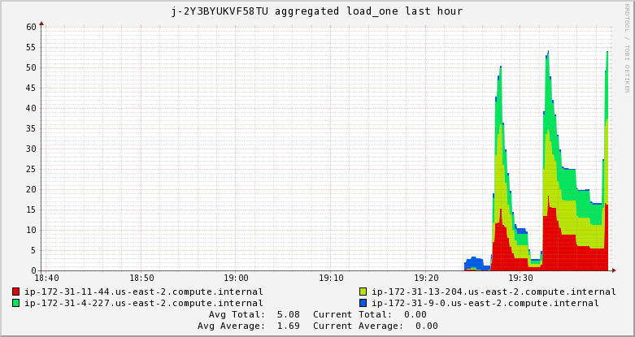
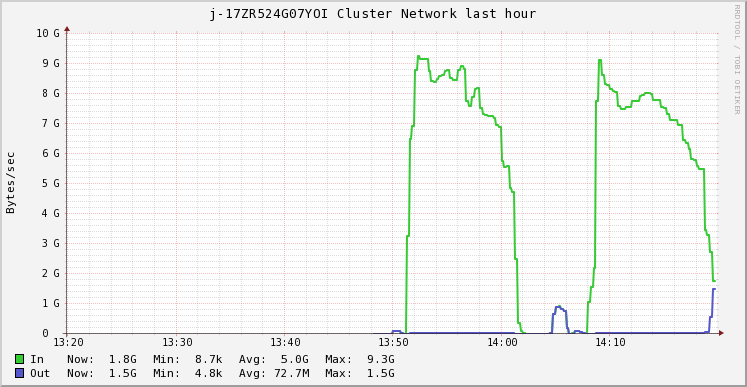
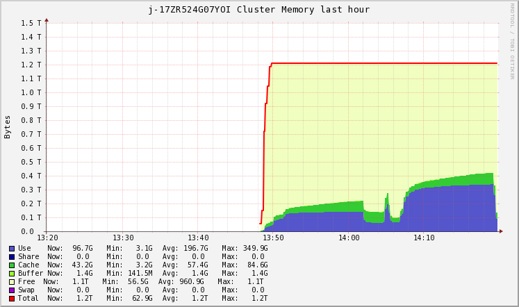

# Processing the GDELT Dataset on AWS
*This blog post was made as part of the course ET4310 Supercomputing for Big Data. Written by Group 30*

In this blog post, the GDELT dataset will be evaluated on Amazon Elastic MapReduce (`EMR`). The goal is to process the entire dataset consisting of 157378 segments on 20 `c4.8xlarge` core nodes in under 30 minutes. The design steps taken in order to achieve this performance are the subject of this post.
 
## Tweaking the code to run on AWS
From the first assignment we have two implementations for processing the GDELT dataset, namely an RDD implementation and a DataFrame implementation. From this point on the DataFrame implementation is used because it was found to yield better performance when operating on a large number of segments.
 
The code is slightly altered in order to run on EMR:
 
- Remove `.master('local')` from `SparkSession.builder()` since this is automatically set by the cluster
- Change input and output paths to `S3`
- Read segments directly from GDELT bucket
- The DataFrame implementation was making use of `.map()` and `.flatMap()` functions. In order to improve readability (and probably some performance as well), this code was rewritten to only make use of the `Spark SQL API` functions. See the attatched source code for more information.
 
## Processing 100 segments
After adapting the code to work in the AWS environment, a test run was performed on 100 segments using 3 `m4.large` machines (single master and 2 nodes). The resulting .json file can be seen below.
 
```
{"date":"2015-02-18","collect_list(named_struct(NamePlaceholder(), topic, NamePlaceholder(), count))":[{"topic":"Islamic State","count":1787},{"topic":"United States","count":1210},{"topic":"New York","count":727},{"topic":"White House","count":489},{"topic":"Los Angeles","count":424},{"topic":"Associated Press","count":385},{"topic":"New Zealand","count":353},{"topic":"United Kingdom","count":325},{"topic":"Jeb Bush","count":298},{"topic":"Practice Wrestling Room","count":280}]}
 
{"date":"2015-02-19","collect_list(named_struct(NamePlaceholder(), topic, NamePlaceholder(), count))":[{"topic":"United States","count":20335},{"topic":"Islamic State","count":15411},{"topic":"New York","count":13131},{"topic":"United Kingdom","count":12926},{"topic":"White House","count":8622},{"topic":"Los Angeles","count":7125},{"topic":"Practice Wrestling Room","count":5810},{"topic":"Associated Press","count":5744},{"topic":"New Zealand","count":5509},{"topic":"Softball Spring Practice Varsity","count":5173}]}
 
{"date":"2015-02-20","collect_list(named_struct(NamePlaceholder(), topic, NamePlaceholder(), count))":[{"topic":"United States","count":1975},{"topic":"Islamic State","count":1958},{"topic":"New York","count":1395},{"topic":"Cyclone Marcia","count":935},{"topic":"Los Angeles","count":823},{"topic":"United Kingdom","count":775},{"topic":"White House","count":713},{"topic":"Associated Press","count":702},{"topic":"Practice Wrestling Room","count":630},{"topic":"Softball Spring Practice Varsity","count":558}]}
```
 
From this .json file it can be seen that all the segments of 19-02-2015 have been processed, while this is probably not the case for 18-02 and 20-02 since these counts are lower.
 
The processing time of the Spark job is 2 minutes. After this preliminary test, it is time to scale up to more segments and see how this affects the processing time of the application.
 
## Processing 1.000 segments on 2 nodes
 
Now, the same test is performed with 1.000 segments using 3 `m4.large` machines (single master and 2 nodes). The step in EMR took 6 minutes to run. The resulting .json file can be seen below.
 
```
{"date":"2015-02-18","collect_list(named_struct(NamePlaceholder(), topic, NamePlaceholder(), count))":[{"topic":"Islamic State","count":1787},{"topic":"United States","count":1210},{"topic":"New York","count":727},{"topic":"White House","count":489},{"topic":"Los Angeles","count":424},{"topic":"Associated Press","count":385},{"topic":"New Zealand","count":353},{"topic":"United Kingdom","count":325},{"topic":"Jeb Bush","count":298},{"topic":"Practice Wrestling Room","count":280}]}
 
{"date":"2015-02-19","collect_list(named_struct(NamePlaceholder(), topic, NamePlaceholder(), count))":[{"topic":"United States","count":20335},{"topic":"Islamic State","count":15411},{"topic":"New York","count":13131},{"topic":"United Kingdom","count":12926},{"topic":"White House","count":8622},{"topic":"Los Angeles","count":7125},{"topic":"Practice Wrestling Room","count":5810},{"topic":"Associated Press","count":5744},{"topic":"New Zealand","count":5509},{"topic":"Softball Spring Practice Varsity","count":5173}]}
 
{"date":"2015-02-20","collect_list(named_struct(NamePlaceholder(), topic, NamePlaceholder(), count))":[{"topic":"United States","count":19556},{"topic":"New York","count":15151},{"topic":"Islamic State","count":12975},{"topic":"United Kingdom","count":12135},{"topic":"Los Angeles","count":8387},{"topic":"White House","count":8286},{"topic":"Practice Wrestling Room","count":6588},{"topic":"Softball Spring Practice Varsity","count":5828},{"topic":"Sydney Morning","count":5111},{"topic":"New Zealand","count":4785}]}
 
.
.
.
```
It can be seen that 20-02 is now fully processes and has topics with higher counts. This confirms that the algorithm is working correctly and that we can further test the scalability of the code.

The resulting .json file was checked for unwanted topics (such as *Type ParentCategory*) that can be added to the exclude list, but none were found.
 
## Scaling to more virtual cores
 
This time the spark application is run on both 1.000 and 10.000 segments using 4 machines (single master and 3 nodes). The machines used are `m4.large`, `m4.xlarge`, and `m4.4xlarge`. The hardware configuration of these machines can be found below.
 
- `m4.large`
    - 4 virtual cores
    - 8 GiB memory
- `m4.xlarge`
    - 8 virtual cores
    - 16 GiB memory
- `m4.4xlarge`
    - 32 virtual cores
    - 64 GiB memory
 
Processing time in minutes for both 1.000 and 10.000 segments on these machines can be seen in the figure below.
 


This figure demonstrates the scaling of 1.000 and 10.000 segments over multiple virtual cores. We are however interested in processing the entire GDELT dataset consisting of 157378 segments.
 
By linearly extrapolating, it could be concluded from this graph that 3 `m4.large` nodes would take roughly 750 minutes to run the entire dataset. Similarly, 3 `m4.xlarge` nodes would take roughly 200 minutes, and 3 `m4.4xlarge` would process within 80 minutes. 
 
If this would turn out to be a good estimation of the runtime, scaling the virtual cores of a node from 4 to 8 (x2) has more impact on the runtime than 8 to 32 (x4). This could be due to the fact that the code is not fully parallelizable. Improvements could be made to increase the level of parallelization in order to further increase the speedup of the program. However according to Amdahl's law the speedup is bound by the sequential fraction of the algorithm and can therefore not scale infinitely.

Additionally, when increasing the number of nodes in the cluster, more communication between the nodes is needed which could cause a bottleneck. Therefore, runtime will not linearly decrease with doubling the amount of virtual cores. 

When looking at the figure below, it can be concluded that the load is spread quite evenly along all nodes (`ip-172-31-9-01` is the master node), meaning that the algorithm is parallelized correctly. 
 


Because the load is spread evenly it makes sense to not only scale our cluster vertically, but also horizontally by adding more nodes. This is done while processing the entire dataset.
 
## Processing the entire dataset
 
This time the entire dataset of 157378 segments ran on 20 `c4.8xlarge` machines. There were some delays here because of an instance limit AWS puts on new accounts, but this can fairly easily be solved by requesting a limit increase.

The first real problem arises when the master node does not have enough memory overhead to run the resource manager `YARN`. Instead of 3 nodes, the master node (which is running the `Spark NameNode`) now has to keep track of 20 nodes and assign tasks accordingly.
 
This problem can be solved by increasing the memory overhead used by `YARN`. By default, this is set to 10% of the total memory available. For the master node, we used a `m4.4xlarge` machine, which has 64GiB memory available. Two dynamic spark flags were set in the `spark-submit` command in order to increase the default value from 6.4GiB to 10GiB: 
 
```
--conf spark.yarn.executor.memoryOverhead = 10240
--conf spark.yarn.executor.memoryOverhead = 10240
```
With enough memory overhead available to the master node, the entire dataset is now processed in 12 minutes, which is well below the maximum of 30 minutes.

Figures of the aggregated load of the cluster and the cluster network can be seen below.


 


When looking at the aggregated load, we can see the nice and sought after rainbow pattern we are looking for (meanin the load is more or less evenly distributed across the nodes).
 
 The fact that the GDELT dataset is so big means that a huge amount of data is shuffled over the network (almost 10 GB/s at its peak!).

 Even though the Spark application runs well below the required 30 minutes, further improvement could be gained by looking into the data shuffled around the network.
 
## Increasing performance using Kryo
In the previous section we saw that a considerable amount of data is shuffled around on the cluster network. All this data has to be serialized before it is sent, which is done using a java serializer.

Kryo is a faster serializer that can be used instead of the default java serializer. It was found that on average 5,7 GB of data is shuffled around the network per second when processing the entire GDELT dataset as described above. In order to serialize this data faster, the Kryo serializer was added to the spark config:
 
```
// Use Kryo
val sparkConf = new SparkConf()
                      .setAppName("GdeltAnalysis")
                      .set("spark.serializer", "org.apache.spark.serializer.KryoSerializer")
                      .registerKryoClasses(
                        Array(classes)
                      )
                          
val spark = SparkSession.builder()
                      .config(sparkConf)
                      .config("spark.kryoserializer.buffer", "10m") 
                      .config("spark.kryoserializer.buffer.max", "1024m") 
                      .getOrCreate()
```
The buffer size is set to 10 MB, which has to accommodate the biggest class shuffled over the network. Also the most frequently used classes by spark are imported into the Kryo serializer to decrease serialization overhead. This list of classed is abbreviated in the code above, but can be found in the attatched source code.
 
Again the entire dataset was processed. The performance in this case in terms of runtime was worse and the cluster finished within 15 minutes. However, it became clear that the network peak was 500 MB/s lower, which is of course a nice incidental. See the figure below.
 

 
Next we increased the Kryo buffer to 100 MB. This decreased the runtime to 12 minutes, which is equal to the runtime without Kryo. However, on avarage ther is 700 MB/s less data shuffled around the network. See the figure below. 
 

 
 Finally, the Kryo buffer is even further increased to 500 MB to see if a greater improvement can be gained. This resulted in a processing time of 13 minutes, meaning that the optimal value for the Kryo buffer is somewhere around 100 MB.

 As a sidenote, it was found that increasing the Kryo buffer size results in a reduced amount of data shuffled around the network. See the figure below in which the cluster network can be seen for 2 consecutive spark jobs with a Kryo buffer size of 10 MB and 500 MB respectively.

 

 It is also noted that increasing the Kryo buffer size results in a higher memory usage and a higher load on the nodes. This can be seen in the figures below, in which the same 2 consecutive spark jobs were run with a Kryo buffer size of 10 MB and 500 MB respectively.



 

## Conclusion
 
In short, apart from some initial problems regarding the limits of `c4.8xlarge` machines, we were able to run these machines after our limit request was accepted by AWS. 

It was also necessary to added two `spark-submit YARN` flags to allocate more memory overhead to the master node. After this the Spark application was able to process the entire GDELT dataset in 12 minutes, which is well below the required 30 minutes. 

We concluded from the results that adding the Kryo serializer did not gain much in terms of run time performance. However, we definitely noticed a decrease in the amount of data shuffled around the network. This can be due to the fact that we registered the most frequently used classes by Spark to Kryo, reducing the serialization overhead.
 
 
## About the authors
 
Bob Luppes 4370236

Mats Rijkeboer 4465237
 


